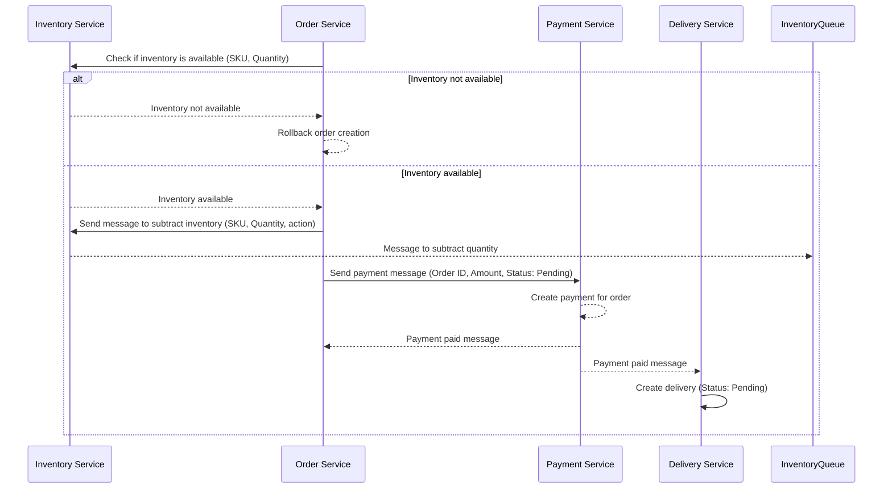

https://medium.com/@buffetbenjamin/securing-fastapi-with-keycloak-the-adventure-begins-part-1-e7eae3b79946

```mermaid
sequenceDiagram
    participant InventoryService as Inventory Service
    participant OrderService as Order Service
    participant PaymentService as Payment Service
    participant DeliveryService as Delivery Service

    OrderService->>InventoryService: Check if inventory is available (SKU, Quantity)
    alt Inventory not available
        InventoryService-->>OrderService: Inventory not available
        OrderService-->>OrderService: Rollback order creation
    else Inventory available
        InventoryService-->>OrderService: Inventory available
        OrderService->>InventoryService: Send message to subtract inventory (SKU, Quantity, action)
        InventoryService-->>InventoryQueue: Message to subtract quantity
        OrderService->>PaymentService: Send payment message (Order ID, Amount, Status: Pending)
        PaymentService-->>PaymentService: Create payment for order
        PaymentService-->>OrderService: Payment paid message
        PaymentService-->>DeliveryService: Payment paid message
        DeliveryService->>DeliveryService: Create delivery (Status: Pending)
    end
```
