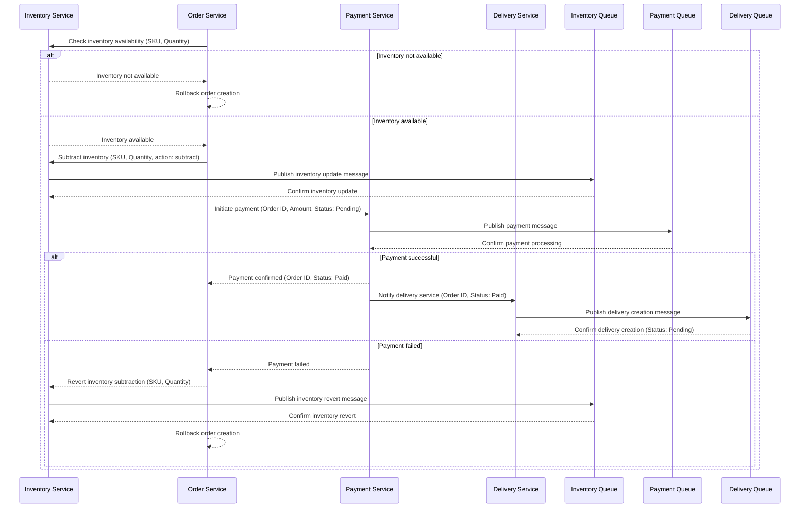

https://medium.com/@buffetbenjamin/securing-fastapi-with-keycloak-the-adventure-begins-part-1-e7eae3b79946

## Saga Pattern



## Kong ApiGateway

### Kong with FastApi

- [behind-a-proxy](https://fastapi.tiangolo.com/advanced/behind-a-proxy/#providing-the-root_path)

http://localhost:8100/inventory/docs#/

### Docker

- **Check declarative config**:

```sh
docker-compose exec kong ls /usr/local/kong/declarative/
```

- **Reload Kong**:

```sh
docker-compose exec kong kong reload
```

### Urls

- **Routes**:

```sh
curl http://localhost:8101/routes
```

- **Services**:

```sh
curl http://localhost:8101/services
```

Example:

```sh
curl http://localhost:8100/inventory/health
```
